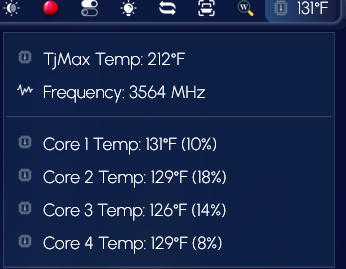

<h1 align="center">
   
  
   
  CoreTemps
   
</h1>

<h4 align="center">Monitor you cpu temps from Droptop.</h4>

  
  
  
  <!--img alt="GitHub all releases" src="https://img.shields.io/github/downloads/papa-boynton/MacOS_About_Box-TheyCallMePapa/total"-->
  

  <a href="#key-features">Key Features</a> •
  <a href="#how-to-use">How To Use</a> •
  <a href="#download">Download</a> •
  <a href="#credits">Credits</a> •
  <a href="#license">License</a>

## Key Features
Can monitor up to 8 cores.

## How to use
Must have Coretemp.exe installed and running.

## Download
[Droptop Four Community Apps](https://droptopfour.com/community-apps/?id=96)

## Credits
Written by [TheyCallMePapa](https://github.com/papa-boynton)

## License
Creative Commons Attribution-Non-Commercial-Share Alike 3.0
